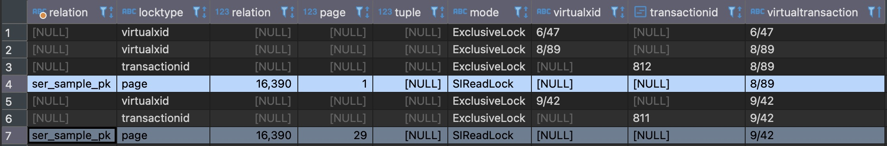

# Serializable isolation errors: crdb vs pgdb
This sample project demonstrates the following:
* normal scenarios for phanton and nonrepeatable reads (and differences due to isolation levels)
* false positives for SERIALIZABLE transaction isolation 
* differences for the false positives between cockroachdb and postgresql

## Running & Testing

1. `docker-compose up` (to start pgdb and crdb for the tests; one of the reasons I didn't use testcontainers is to keep the instances up for inspection). This starts:
   1. a PostgreSQL on port 5432 (db: sample, user: sampleuser, pass:secret). A psql.conf is overridden, mainly to enforce `enable_seqscan = off` (avoid sequential scan if there are only a few entries in a db)
   2. a CockroachDB on port 26200 (db: sample, user: root)
2. Run the tests using your favourite IDE or:
   1. `./gradlew clean test` to test for pgdb or
   2. `SPRING_PROFILES_ACTIVE=crdb,serializable ./gradlew clean test` to run tests for crdb (or set an env variable if using windows, like `$Env:SPRING_PROFILES_ACTIVE="crdb,serializable"` or `set SPRING_PROFILES_ACTIVE=crdb,serializable`)

Running the application on its own does not do anything special, creates a table and loads up 10k entries used for the tests.

## Test analysis

Below you may find details on the tests. I highly recommend debugging the tests and while waiting on the breakpoints, have a look at PostgreSQL's lock table. This helps understand the locks that lead to the serializable exceptions.

The query used to understand better is:

`select relation::regclass, locktype, relation, page, tuple, mode, virtualxid, transactionid, virtualtransaction from pg_catalog.pg_locks where mode like 'SI%Lock' or mode = 'ExclusiveLock';
`

### Class `IsolationSerializableTest`
1. `shouldFailDueToSIReadLockOnSameIndexPageAndUpdateOnIndexedColumn()`  
This is the main false positive scenario that may happen **only on PostgreSQL**. If you remove the *@DisabledIfEnvironmentVariable* and run it with *SPRING_PROFILES_ACTIVE=crdb*, the test will fail (it will fail expecting an Exception, because crdb handles better this scenario and does not raise a false positive serializable exception).  
This has been identified in both statement-manager and subscription-manager2.  
The steps are as following:
   1. Multiple threads are querying side-by-side index entries (in this case: id 1 and 2, which reside on the same index page)
   2. This leads to SIRead lock from both threads on the same index page
   3. Afterwards, because we are updating an indexed column, and both threads have an SIRead lock on the same index page, a read/write serializable error is raised. 
   4. Note, the page lock is on the pk index, whereas the updated column is another index.

Below is an image of the locks table, showing two threads holding the same SIRead lock on the same index page. Upon updating the entities, it will fail, because it will notice a potential read/write dependency on those. If we weren't to update the entities, it will not fail.

2. `shouldSucceedBecauseSIReadLockOnDifferentIndexPageAndUpdateOnIndexedColumn()`  
This is the same as above, but the first step (i) does not query entries, whose index keys reside on the same page, but rather different pages. This does not lead to any serialization failures. This is a normal scenario.

Below you may find the locks for this case. It's the same scenario as above, but the SIRead locks are on different pages. As such, a conflict is not raised.

3. `shouldFailToUpdateNonSerializableTransactions()`  
This is a normal serializability issue. Two transaction being run concurrently that may end up in a DB state that is not reachable if you run the transactions serially (regardless of order) is not acceptable. The same test is OK under read-committed.

4. `phantomReadTest()` and `nonRepeatableReadTest()`  
These two tests show the respective scenarios that are not possible under serialization isolation level.

6. `shouldSucceedForUpdatesOnNonIndexedColumn()`  
Currently disabled. This 'may' fail on PostgreSQL, it will never fail on CockroachDB.  
This is the same case as the first one: 
   1. multiple threads query side-by-side indexes from different threads
   2. this leads to SIRead locks from both threads on the same index page
   3. We update a non-indexed column

On PostgreSQL, this scenario seems to be raising a serialization failure intermittently. It starts by locking both the index page and the tuple, but it may release the tuple SIRead lock. On the cases that it does so, the update goes through without a problem. On the cases it still holds onto the SIRead lock on both the index page and the tuple, it will fail.  
Normally, this should be failing all the time (as in the first scenario), the only difference being the indexed column update. This is quite mysterious, but at this point we are just trying to reverse-identify the internals of the SSI algorithm. So, with a grain of salt, the identified cases are below.

Failed cases:

Successful cases:

### Class `IsolationReadCommittedTest`
This class contains tests ran with read-committed isolation level.  
They show the difference in results that may lead to inconsistencies when serializable isolation level is not being used.  

### Class `IsolationSerializableCommonFailureTest`

This is a scenario throwing serializable exception on both postgresql and crdb. 
We are querying without index, essentially doing a table scan putting locks on the whole relation.  
This is also a false positive, because we are updating unrelated rows. But querying without index is a no-go in general, so this is difficult to happen in a production scenario. It is merely here for completeness.

Below you will notice that there is a `relation` lock (that is: the whole table is locked). This will fail, because each transaction had to go through the whole table to find the entry we are talking about, essentially locking it all. As such, a serialization conflict is raised when trying to update.
